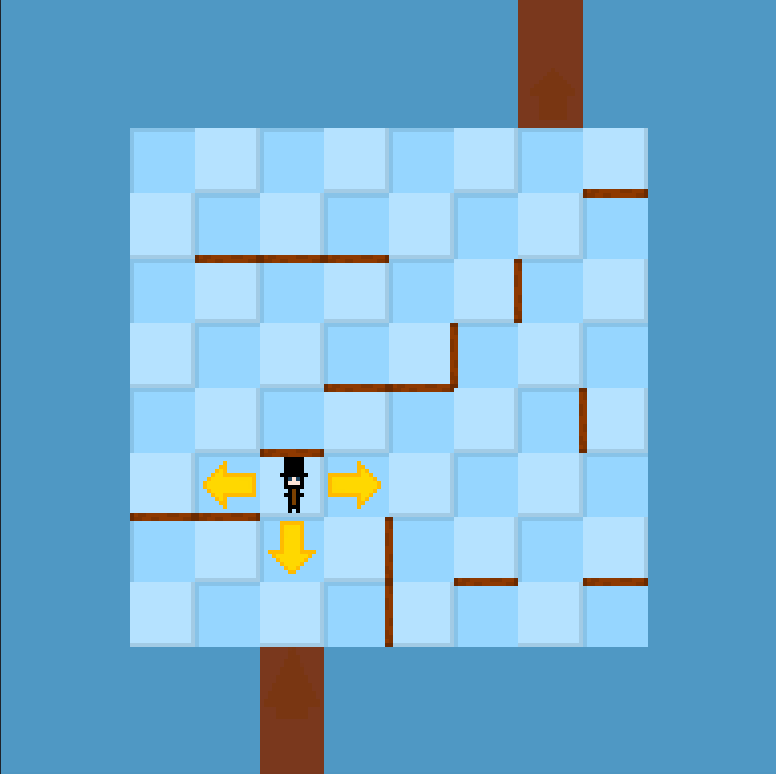

# LaytonSlipperyCrossings
Basic reimplementation of the Puzzle DB126 "Slippery Crossings" from Professor Layton and the Diabolical Box using the Godot Engine.
## Screenshots

## TODO
- [ ] Sound effects when hitting a wall
- [ ] Background music
- [ ] Introduction Tutorial Text
- [ ] Win Condition
## Installation
**Currently there are no exported builds of the game.**

This project is meant to be opened and edited in the Godot engine.
- You will need the Godot Engine https://godotengine.org/
- Clone this repository
- Import the folder as a Godot project
